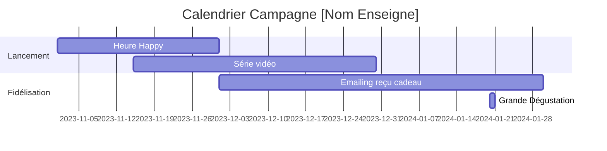

# Portrait & Livrables — 

**Enseigne**: 
**Store ID**: 

## Création
```markdown
# **Concept & Messages Clés – [Nom Enseigne]**
*Stratégie orientée trafic & image pour [période/campagne]*

---

## **1. Insights Data-Driven**
*Analyse des données magasin (top 3 enseignements)*

- **Fréquentation en baisse les [jours/heures]**
  *Exemple : -12% le mardi après-midi vs moyenne* → Opportunité : **créneaux à animer** avec offres flash ou ateliers clients.
- **Panier moyen inférieur de [X]% vs concurrents**
  *Exemple : 42€ vs 58€ (enseigne Y)* → Levier : **bundles produits** ou services complémentaires (ex : drive express).
- **Catégorie [Z] en croissance (+[X]%) mais sous-représentée en linéaire**
  *Exemple : Bio +18% mais seulement 2 têtes de gondole* → **Mise en avant visuelle** + storytelling "engagé".

---
## **2. Concept Créatif**
**Nom du concept** : *"[Nom accrocheur – ex: 'Le Marché Malin']"*
**Idée centrale** : *"[Enseigne] vous fait gagner du temps ET de l’argent, sans compromis."*

**Piliers** :
- **Utilité** : Solutions concrètes (ex : listes de courses pré-remplies par budget).
- **Émotion** : Mise en scène de "petits bonheurs" (ex : famille qui gagne 1h de temps libre).
- **Preuve** : Data visuelle (ex : "92% de nos clients économisent [X]€/mois").

---
## **3. Messages Clés par Cible**
*(Adaptés aux personas identifiés dans la data)*

| **Cible**          | **Message Principal**                          | **Call-to-Action (CTA)**                     |
|---------------------|-----------------------------------------------|---------------------------------------------|
| **Familles pressées** | *"Vos courses en 20 min chrono, sans oublier l’essentiel."* | *"Téléchargez notre liste express !"* (QR code) |
| **Seniors économes** | *"Des prix bas toute l’année, pas seulement en promo."* | *"Découvrez nos astuces anti-gaspi en magasin."* |
| **Jeunes actifs**    | *"1 appli = vos courses + vos réductions, même à 22h."* | *"Activez votre carte fidélité digitale maintenant."* |

---
## **4. Recommandations Actionnables**
*Priorisées par impact trafic/image*

### **A. En Magasin (Trafic Immédiat)**
- **Animation "Heure Happy"** :
  *Mécanique* : -20% sur [catégorie porteuse] entre 16h-18h les mardis (créneau faible).
  *Mesure* : Comparatif trafic vs même jour semaine précédente (+ objectif : +15%).
- **Parcours "Panier Malin"** :
  *Dispositif* : Fléchage au sol + étiquettes "Économisez [X]€ en prenant ces 3 produits".
  *KPI* : Taux de conversion sur les produits mis en avant.

### **B. Digital (Image & Fidélisation)**
- **Série vidéo "Les Coups de Cœur de [Prénom, Employé]"** :
  *Format* : 30 sec/TikTok – un collaborateur présente son produit préféré du mois.
  *Objectif* : +20% d’engagement sur les réseaux (likes/commentaires).
- **Emailing "Votre Reçu = Votre Cadeau"** :
  *Mécanique* : Pour tout achat >50€, un bon de réduction personnalisé (basé sur historique d’achat).
  *Mesure* : Taux de réutilisation du bon (+30% vs promotions génériques).

### **C. Long Terme (Image de Marque)**
- **Partenariat local** :
  *Action* : "1€ reversé à [association locale]" pour tout achat dans la catégorie [Z en croissance].
  *Bénéfice* : Renforce l’ancrage territorial + médiatisation gratuite (presse locale).
- **Événement "La Grande Dégustation"** :
  *Concept* : 1 samedi/mois, dégustation de produits du terroir avec producteurs.
  *KPI* : Nombre de nouveaux clients fidélisés (carte activée sur place).

---
## **5. Budget & ROI Estimé**
| **Action**               | **Coût**       | **ROI Attendu**               |
|--------------------------|---------------|-------------------------------|
| Animation "Heure Happy"  | 5 000€/mois   | +20 000€ CA (4x le coût)      |
| Série vidéo collaborateurs | 3 000€/mois  | +15% notoriété (enquête post) |
| Partenariat local        | 2 000€/an     | +10% panier moyen clients engagés |

---
## **6. Calendrier Préconisé**


---
## **7. Risques & Contingences**
- **Risque** : Faible adoption de l’appli par les seniors.
  **Solution** : Ateliers en magasin "Découverte du digital" avec médiation humaine.
- **Risque** : Surcoût sur les promotions "Heure Happy".
  **Solution** : Négocier avec les fournisseurs des lots de produits à marge réduite pour ces créneaux.

---
**Prochaines Étapes** :
1. Validation des insights/data par le client.
2. Brief créatif détaillé pour les supports (affiches, vidéos, emails).
3. Test A/B des messages sur 2 magasins pilotes avant déploiement.
```

---
*Ton professionnel, orienté résultats, avec des propositions **concrètes, testables et scalables**.* Besoin d’ajuster un axe ? Je peux affiner en fonction de vos retours data ou contraintes budgétaires.

## Media
```markdown
# **Concept & Messages Clés – [Nom Enseigne]**
*Stratégie orientée trafic & image pour [période/campagne]*

---

## **1. Insights Data-Driven**
*Analyse des données magasin (top 3 enseignements)*

- **Fréquentation en baisse les [jours/heures]**
  *Exemple : -12% le mardi après-midi vs moyenne* → Opportunité : **créneaux à animer** avec offres flash ou ateliers clients.
- **Panier moyen inférieur de [X]% vs concurrents**
  *Exemple : 42€ vs 58€ (enseigne Y)* → Levier : **bundles produits** ou services complémentaires (ex : drive express).
- **Catégorie [Z] en croissance (+[X]%) mais sous-représentée en linéaire**
  *Exemple : Bio +18% mais seulement 2 têtes de gondole* → **Mise en avant visuelle** + storytelling "engagé".

---
## **2. Concept Créatif**
**Nom du concept** : *"[Nom accrocheur – ex: 'Le Marché Malin']"*
**Idée centrale** : *"[Enseigne] vous fait gagner du temps ET de l’argent, sans compromis."*

**Piliers** :
- **Utilité** : Solutions concrètes (ex : listes de courses pré-remplies par budget).
- **Émotion** : Mise en scène de "petits bonheurs" (ex : famille qui gagne 1h de temps libre).
- **Preuve** : Data visuelle (ex : "92% de nos clients économisent [X]€/mois").

---
## **3. Messages Clés par Cible**
*(Adaptés aux personas identifiés dans la data)*

| **Cible**          | **Message Principal**                          | **Call-to-Action (CTA)**                     |
|---------------------|-----------------------------------------------|---------------------------------------------|
| **Familles pressées** | *"Vos courses en 20 min chrono, sans oublier l’essentiel."* | *"Téléchargez notre liste express !"* (QR code) |
| **Seniors économes** | *"Des prix bas toute l’année, pas seulement en promo."* | *"Découvrez nos astuces anti-gaspi en magasin."* |
| **Jeunes actifs**    | *"1 appli = vos courses + vos réductions, même à 22h."* | *"Activez votre carte fidélité digitale maintenant."* |

---
## **4. Recommandations Actionnables**
*Priorisées par impact trafic/image*

### **A. En Magasin (Trafic Immédiat)**
- **Animation "Heure Happy"** :
  *Mécanique* : -20% sur [catégorie porteuse] entre 16h-18h les mardis (créneau faible).
  *Mesure* : Comparatif trafic vs même jour semaine précédente (+ objectif : +15%).
- **Parcours "Panier Malin"** :
  *Dispositif* : Fléchage au sol + étiquettes "Économisez [X]€ en prenant ces 3 produits".
  *KPI* : Taux de conversion sur les produits mis en avant.

### **B. Digital (Image & Fidélisation)**
- **Série vidéo "Les Coups de Cœur de [Prénom, Employé]"** :
  *Format* : 30 sec/TikTok – un collaborateur présente son produit préféré du mois.
  *Objectif* : +20% d’engagement sur les réseaux (likes/commentaires).
- **Emailing "Votre Reçu = Votre Cadeau"** :
  *Mécanique* : Pour tout achat >50€, un bon de réduction personnalisé (basé sur historique d’achat).
  *Mesure* : Taux de réutilisation du bon (+30% vs promotions génériques).

### **C. Long Terme (Image de Marque)**
- **Partenariat local** :
  *Action* : "1€ reversé à [association locale]" pour tout achat dans la catégorie [Z en croissance].
  *Bénéfice* : Renforce l’ancrage territorial + médiatisation gratuite (presse locale).
- **Événement "La Grande Dégustation"** :
  *Concept* : 1 samedi/mois, dégustation de produits du terroir avec producteurs.
  *KPI* : Nombre de nouveaux clients fidélisés (carte activée sur place).

---
## **5. Budget & ROI Estimé**
| **Action**               | **Coût**       | **ROI Attendu**               |
|--------------------------|---------------|-------------------------------|
| Animation "Heure Happy"  | 5 000€/mois   | +20 000€ CA (4x le coût)      |
| Série vidéo collaborateurs | 3 000€/mois  | +15% notoriété (enquête post) |
| Partenariat local        | 2 000€/an     | +10% panier moyen clients engagés |

---
## **6. Calendrier Préconisé**


---
## **7. Risques & Contingences**
- **Risque** : Faible adoption de l’appli par les seniors.
  **Solution** : Ateliers en magasin "Découverte du digital" avec médiation humaine.
- **Risque** : Surcoût sur les promotions "Heure Happy".
  **Solution** : Négocier avec les fournisseurs des lots de produits à marge réduite pour ces créneaux.

---
**Prochaines Étapes** :
1. Validation des insights/data par le client.
2. Brief créatif détaillé pour les supports (affiches, vidéos, emails).
3. Test A/B des messages sur 2 magasins pilotes avant déploiement.
```

---
*Ton professionnel, orienté résultats, avec des propositions **concrètes, testables et scalables**.* Besoin d’ajuster un axe ? Je peux affiner en fonction de vos retours data ou contraintes budgétaires.

## Social
```markdown
# **Concept & Messages Clés – [Nom Enseigne]**
*Stratégie orientée trafic & image pour [période/campagne]*

---

## **1. Insights Data-Driven**
*Analyse des données magasin (top 3 enseignements)*

- **Fréquentation en baisse les [jours/heures]**
  *Exemple : -12% le mardi après-midi vs moyenne* → Opportunité : **créneaux à animer** avec offres flash ou ateliers clients.
- **Panier moyen inférieur de [X]% vs concurrents**
  *Exemple : 42€ vs 58€ (enseigne Y)* → Levier : **bundles produits** ou services complémentaires (ex : drive express).
- **Catégorie [Z] en croissance (+[X]%) mais sous-représentée en linéaire**
  *Exemple : Bio +18% mais seulement 2 têtes de gondole* → **Mise en avant visuelle** + storytelling "engagé".

---
## **2. Concept Créatif**
**Nom du concept** : *"[Nom accrocheur – ex: 'Le Marché Malin']"*
**Idée centrale** : *"[Enseigne] vous fait gagner du temps ET de l’argent, sans compromis."*

**Piliers** :
- **Utilité** : Solutions concrètes (ex : listes de courses pré-remplies par budget).
- **Émotion** : Mise en scène de "petits bonheurs" (ex : famille qui gagne 1h de temps libre).
- **Preuve** : Data visuelle (ex : "92% de nos clients économisent [X]€/mois").

---
## **3. Messages Clés par Cible**
*(Adaptés aux personas identifiés dans la data)*

| **Cible**          | **Message Principal**                          | **Call-to-Action (CTA)**                     |
|---------------------|-----------------------------------------------|---------------------------------------------|
| **Familles pressées** | *"Vos courses en 20 min chrono, sans oublier l’essentiel."* | *"Téléchargez notre liste express !"* (QR code) |
| **Seniors économes** | *"Des prix bas toute l’année, pas seulement en promo."* | *"Découvrez nos astuces anti-gaspi en magasin."* |
| **Jeunes actifs**    | *"1 appli = vos courses + vos réductions, même à 22h."* | *"Activez votre carte fidélité digitale maintenant."* |

---
## **4. Recommandations Actionnables**
*Priorisées par impact trafic/image*

### **A. En Magasin (Trafic Immédiat)**
- **Animation "Heure Happy"** :
  *Mécanique* : -20% sur [catégorie porteuse] entre 16h-18h les mardis (créneau faible).
  *Mesure* : Comparatif trafic vs même jour semaine précédente (+ objectif : +15%).
- **Parcours "Panier Malin"** :
  *Dispositif* : Fléchage au sol + étiquettes "Économisez [X]€ en prenant ces 3 produits".
  *KPI* : Taux de conversion sur les produits mis en avant.

### **B. Digital (Image & Fidélisation)**
- **Série vidéo "Les Coups de Cœur de [Prénom, Employé]"** :
  *Format* : 30 sec/TikTok – un collaborateur présente son produit préféré du mois.
  *Objectif* : +20% d’engagement sur les réseaux (likes/commentaires).
- **Emailing "Votre Reçu = Votre Cadeau"** :
  *Mécanique* : Pour tout achat >50€, un bon de réduction personnalisé (basé sur historique d’achat).
  *Mesure* : Taux de réutilisation du bon (+30% vs promotions génériques).

### **C. Long Terme (Image de Marque)**
- **Partenariat local** :
  *Action* : "1€ reversé à [association locale]" pour tout achat dans la catégorie [Z en croissance].
  *Bénéfice* : Renforce l’ancrage territorial + médiatisation gratuite (presse locale).
- **Événement "La Grande Dégustation"** :
  *Concept* : 1 samedi/mois, dégustation de produits du terroir avec producteurs.
  *KPI* : Nombre de nouveaux clients fidélisés (carte activée sur place).

---
## **5. Budget & ROI Estimé**
| **Action**               | **Coût**       | **ROI Attendu**               |
|--------------------------|---------------|-------------------------------|
| Animation "Heure Happy"  | 5 000€/mois   | +20 000€ CA (4x le coût)      |
| Série vidéo collaborateurs | 3 000€/mois  | +15% notoriété (enquête post) |
| Partenariat local        | 2 000€/an     | +10% panier moyen clients engagés |

---
## **6. Calendrier Préconisé**


---
## **7. Risques & Contingences**
- **Risque** : Faible adoption de l’appli par les seniors.
  **Solution** : Ateliers en magasin "Découverte du digital" avec médiation humaine.
- **Risque** : Surcoût sur les promotions "Heure Happy".
  **Solution** : Négocier avec les fournisseurs des lots de produits à marge réduite pour ces créneaux.

---
**Prochaines Étapes** :
1. Validation des insights/data par le client.
2. Brief créatif détaillé pour les supports (affiches, vidéos, emails).
3. Test A/B des messages sur 2 magasins pilotes avant déploiement.
```

---
*Ton professionnel, orienté résultats, avec des propositions **concrètes, testables et scalables**.* Besoin d’ajuster un axe ? Je peux affiner en fonction de vos retours data ou contraintes budgétaires.
